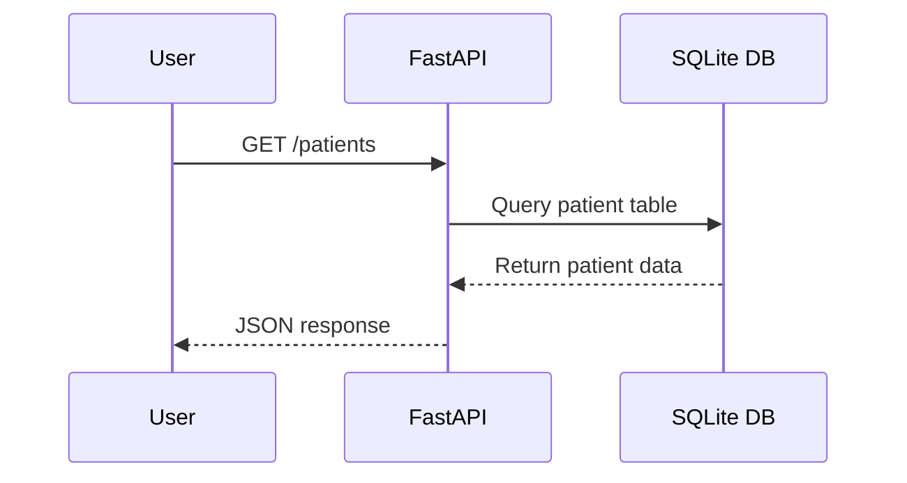

# Healthcare Data Platform MVP

This project demonstrates a modern healthcare data platform, inspired by the Medical Data Specialist role at Boston Scientific. It covers:
- ETL pipeline development (Python, Spark)
- Data modeling (relational and NoSQL, e.g., PostgreSQL, MongoDB)
- FHIR/HL7 ingestion and integration
- Cloud-native data engineering (AWS Glue, S3, EMR, Lambda, ECS, Terraform)
- Data APIs (FastAPI)
- Analytics and reporting
- Data quality and compliance (HIPAA, FDA 21 CFR Part 11)

- ## Architecture Diagram

```mermaid
flowchart TD
	A[Sample EHR JSON] --> B[ETL Pipeline (Python)]
	B --> C[SQLite DB]
	C --> D[FastAPI Data API]
	D -->|/patients| E[User/Consumer]
```

## Project Structure
- `etl/` - ETL pipeline code (extract, transform, load, SQLite MVP)
- `integration/` - Data ingestion and integration (FHIR, APIs)
- `api/` - Data delivery APIs (FastAPI, SQLite MVP)
- `analytics/` - Analytics and reporting
- `quality/` - Data quality checks
- `compliance/` - Compliance and audit scripts
- `infra/terraform/` - Infrastructure as code (AWS Glue, etc.)
- `schemas/` - Example relational and NoSQL schemas
- `tests/` - Test cases

## Data Flow Example



## MVP Demo
1. **Run ETL pipeline:**
	```bash
	python etl/etl_mvp.py
	```
	This loads sample EHR data from JSON into a local SQLite database (`patients.db`).

2. **Start API service:**
	```bash
	uvicorn api.data_service:app --reload
	```
	Endpoints:
	- `GET /patients` — List all patients
	- `GET /patients/{patient_id}` — Get patient by ID

## Key Tools & Technologies
- **Python**: Core ETL, API, and scripting
- **Spark**: (for scalable ETL, see etl/)
- **FastAPI**: Data delivery APIs
- **SQLite**: MVP database (swap for PostgreSQL in production)
- **PostgreSQL, MongoDB**: Data modeling (schemas/)
- **AWS Glue, S3, EMR, Lambda, ECS**: Cloud-native data engineering (infra/terraform/)
- **Terraform**: Infrastructure as code
- **FHIR, HL7**: Healthcare data standards (integration/)
- **pytest**: Testing

## Compliance & Data Quality
- Example scripts for HIPAA/FDA data handling (compliance/)
- Data quality checks (quality/)

## How to Extend
- Swap SQLite for PostgreSQL or MongoDB
- Add FHIR/HL7 ingestion (integration/)
- Expand ETL with Spark or AWS Glue
- Add data quality and compliance checks
- Deploy on AWS using Terraform

## Example Requirements
- Python 3.8+
- fastapi, uvicorn, sqlite3, requests, pytest
- (Optional: pyspark, boto3, psycopg2, etc.)

## About
This scaffold is designed for demonstration and interview purposes, reflecting the skills and tools required for a Medical Data Specialist in a regulated healthcare environment.
