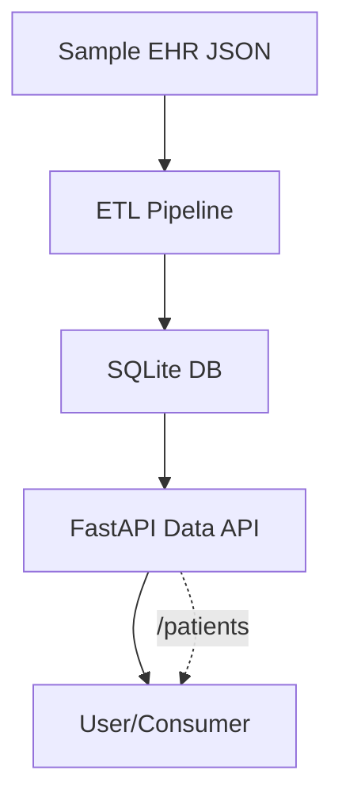
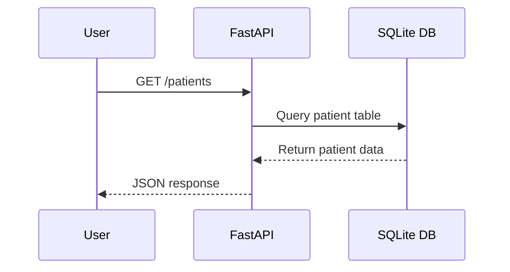

# Healthcare Data Platform MVP

This project demonstrates a modern healthcare data platform. It covers:
- ETL pipeline development (Python, Spark)
- Data modeling (relational and NoSQL, e.g., PostgreSQL, MongoDB)
- FHIR/HL7 ingestion and integration
- Cloud-native data engineering (AWS Glue, S3, EMR, Lambda, ECS, Terraform)
- Data APIs (FastAPI)
- Analytics and reporting
- Data quality and compliance (HIPAA, FDA 21 CFR Part 11)

- ## Architecture Diagram



## Project Structure
- `etl/` - ETL pipeline code (extract, transform, load, SQLite MVP)
- `integration/` - Data ingestion and integration (FHIR, APIs)
- `api/` - Data delivery APIs (FastAPI, SQLite MVP)
- `analytics/` - Analytics and reporting
- `quality/` - Data quality checks
- `compliance/` - Compliance and audit scripts
- `infra/terraform/` - Infrastructure as code (AWS Glue, etc.)
- `schemas/` - Example relational and NoSQL schemas
- `tests/` - Test cases

## Data Flow Example



## MVP Demo
1. **Run ETL pipeline:**
	```bash
	python etl/etl_mvp.py
	```
	This loads sample EHR data from JSON into a local SQLite database (`patients.db`).

2. **Start API service:**
	```bash
	uvicorn api.data_service:app --reload
	```
	Endpoints:
	- `GET /patients` — List all patients
	- `GET /patients/{patient_id}` — Get patient by ID

## Key Tools & Technologies
- **Python**: Core ETL, API, and scripting
- **Spark**: (for scalable ETL, see etl/)
- **FastAPI**: Data delivery APIs
- **SQLite**: MVP database (swap for PostgreSQL in production)
- **PostgreSQL, MongoDB**: Data modeling (schemas/)
- **AWS Glue, S3, EMR, Lambda, ECS**: Cloud-native data engineering (infra/terraform/)
- **Terraform**: Infrastructure as code
- **FHIR, HL7**: Healthcare data standards (integration/)
- **pytest**: Testing

## Compliance & Data Quality
- Example scripts for HIPAA/FDA data handling (compliance/)
- Data quality checks (quality/)

## How to Extend
- Swap SQLite for PostgreSQL or MongoDB
- Add FHIR/HL7 ingestion (integration/)
- Expand ETL with Spark or AWS Glue
- Add data quality and compliance checks
- Deploy on AWS using Terraform

## Example Requirements
- Python 3.8+
- fastapi, uvicorn, sqlite3, requests, pytest
- (Optional: pyspark, boto3, psycopg2, etc.)

## About
This scaffold is designed for demonstration and interview purposes, reflecting the skills and tools required for a Medical Data Specialist in a regulated healthcare environment.

## Airflow 3.x: Local Project Setup & Usage

This project uses a fully project-local Airflow 3.x environment. Follow these steps to install, configure, and run Airflow with only your project DAGs:

### 1. Create and Activate a Virtual Environment
```bash
python3.11 -m venv .venv
source .venv/bin/activate
```

### 2. Install Airflow
```bash
pip install "apache-airflow==3.1.5"
```

### 3. Set Up Airflow Home and Disable Example DAGs
Always set these environment variables before running any Airflow command:
```bash
export AIRFLOW_HOME="$PWD/airflow"
export AIRFLOW__CORE__LOAD_EXAMPLES=False
```

### 4. Initialize the Airflow Database
```bash
airflow db migrate
```

### 5. Create an Admin User (if needed)
```bash
airflow users create --username admin --firstname Admin --lastname User --role Admin --email admin@example.com --password <your-password>
```

### 6. Start Airflow Services
**In two separate terminals:**

**Terminal 1:**
```bash
source .venv/bin/activate
export AIRFLOW_HOME="$PWD/airflow"
export AIRFLOW__CORE__LOAD_EXAMPLES=False
airflow api-server --port 8080
```

**Terminal 2:**
```bash
source .venv/bin/activate
export AIRFLOW_HOME="$PWD/airflow"
export AIRFLOW__CORE__LOAD_EXAMPLES=False
airflow scheduler
```

### 7. Access the Airflow UI
Go to: http://localhost:8080

You should see only your project DAGs (from `airflow/dags`). No example DAGs will be loaded.

### 8. Troubleshooting
- If example DAGs still appear, stop all Airflow processes, ensure the environment variable is set, and restart both the API server and scheduler.
- To reset the Airflow database (removes all DAG history):
    ```bash
    airflow db reset
    ```

---
